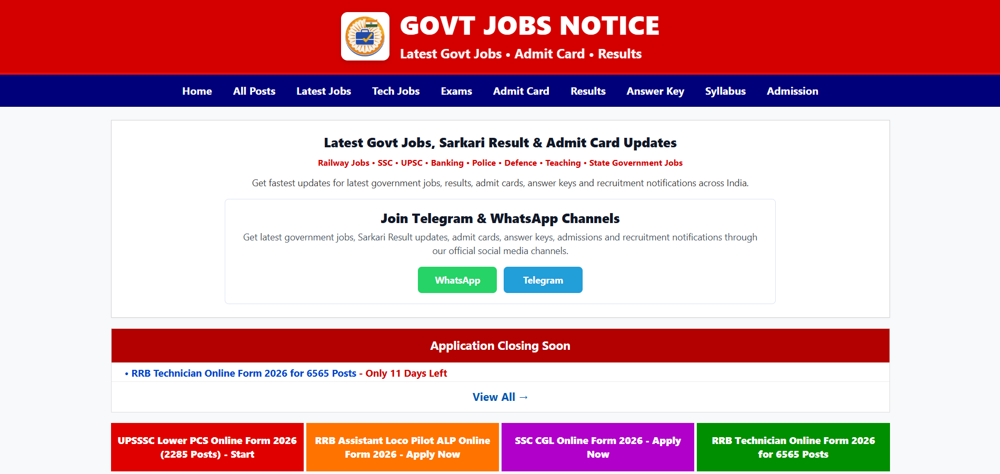
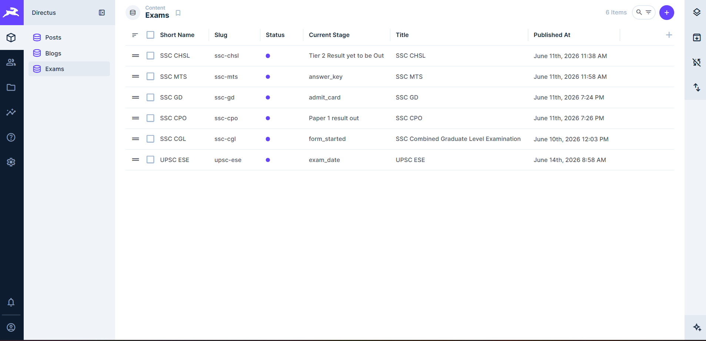
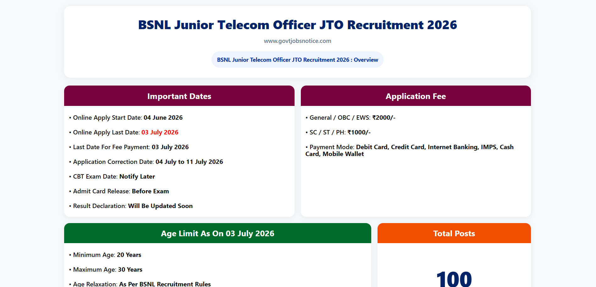
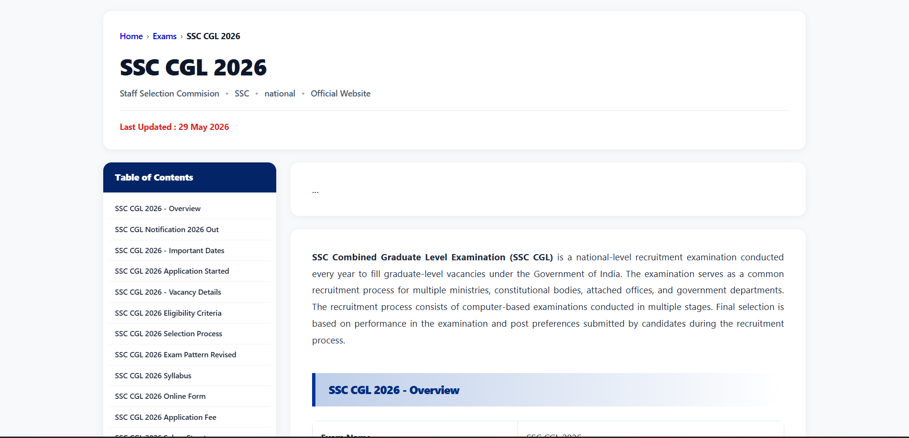

# GovtJobsNotice

> A fast, accessible job-notice portal that helps Indian job seekers discover government vacancies, exams, admit cards, results, and important updates in one place.

**Live site:** [govtjobsnotice.com](https://govtjobsnotice.com/)

> **Portfolio showcase:** This repository is shared to demonstrate professional work and technical capability. The codebase, design, content model, automation approach, and business concepts are proprietary. Do not copy, redistribute, or use any part of this project without prior written permission.

## About

GovtJobsNotice is a full-stack platform built to make public-sector recruitment information easier to find and follow. It brings together notices and updates so visitors can quickly check what is new, understand the next step, and follow the relevant official source.

The public-facing site is built with [Astro](https://astro.build/) and Node.js, while content is managed through a [Directus](https://directus.io/) CMS admin panel. The Directus service is hosted on Render and uses Supabase as its database.

## Features

- Government job vacancy and recruitment notices
- Exam-related pages and important dates
- Admit card, result, and answer-key updates
- Clear, easy-to-scan page layouts for fast access to information
- SEO-focused, static-first site architecture
- Responsive design for desktop and mobile visitors
- CMS-powered content management through Directus
- Cloud-hosted backend and database using Render and Supabase
- Job-scraping and publishing automation in active development

## Screenshots

> Replace the image files below with your own screenshots. Keep all screenshots in `docs/images/` so they render correctly on GitHub.

| Public website | Directus admin panel |
| --- | --- |
|  |  |

| Job or exam detail page | Automation workflow |
| --- | --- |
|  |  |

### Image template

Create screenshots with these suggested filenames:

```text
docs/images/
├── public-site.png          # Homepage or key public-facing page
├── directus-admin.png       # Directus dashboard or content editor
├── job-detail.png           # Vacancy, exam, result, or admit-card page
└── automation-workflow.png  # Scraper / validation / publishing process
```

For the strongest presentation, use clean screenshots with no sensitive credentials, personal data, or production-only statistics visible.

## Tech stack

- [Astro](https://astro.build/)
- Node.js
- JavaScript / TypeScript
- [Directus](https://directus.io/) — headless CMS and admin panel
- [Render](https://render.com/) — Directus hosting
- [Supabase](https://supabase.com/) — managed PostgreSQL database
- HTML and CSS
- npm

## Getting started

### Prerequisites

Install a current LTS version of [Node.js](https://nodejs.org/) (which includes npm).

### Installation

```bash
git clone https://github.com/SiddhantXCodes/govtjobsnotice.git
cd govtjobsnotice
npm install
```

### Run locally

```bash
npm run dev
```

Then open the local address shown in your terminal (typically `http://localhost:4321`).

## Available commands

| Command | Description |
| --- | --- |
| `npm run dev` | Starts the local development server. |
| `npm run build` | Creates a production-ready build. |
| `npm run preview` | Serves the production build locally for review. |
| `npm run astro` | Runs Astro commands directly. |

## Project structure

```text
/
├── public/          # Static assets served as-is
├── src/             # Pages, layouts, components, and content
├── .github/          # GitHub Actions and repository automation
├── astro.config.mjs  # Astro configuration
├── package.json      # Scripts and dependencies
└── tsconfig.json     # TypeScript configuration
```

## Architecture

```text
Visitors
   │
   ▼
Astro + Node.js frontend
   │
   ▼
Directus CMS admin panel (hosted on Render)
   │
   ▼
Supabase PostgreSQL database
```

Content editors manage job notices and updates through Directus. The Astro frontend retrieves and presents this content as a fast, search-friendly public website.

## Job-scraping automation

Automated job-notice collection is currently under development. The goal is to collect eligible public recruitment updates, validate and normalize the data, then make it available for editorial review before publishing.

> Automation should support—not replace—verification. Every notice should be checked against its official source before it is published.

## Configuration

The frontend needs the Directus API endpoint and any required access credentials configured through environment variables. Keep secrets out of version control and store production values in your hosting provider's environment settings.

Example:

```env
PUBLIC_DIRECTUS_URL=https://your-directus-instance.example.com
DIRECTUS_TOKEN=your-read-only-token
```

Use the variable names that match your implementation; never expose a privileged Directus token in client-side code.

## Content and accuracy

Always verify vacancy dates, eligibility, application instructions, and other recruitment details against the relevant official government or recruiting-body website before taking action. GovtJobsNotice is an informational platform and is not affiliated with, endorsed by, or operated by any government agency.

## Contributing

Contributions and improvements are welcome. Please open an issue first for significant changes, then submit a focused pull request with a clear description of the update.

## Author

Created and maintained by [Siddhant Mishra](https://github.com/SiddhantXCodes).

## License

© 2026 Siddhant Mishra. All rights reserved.

This is a proprietary project shared for portfolio and demonstration purposes only. No permission is granted to copy, modify, distribute, reuse, or commercially exploit the source code, design, content structure, automation workflow, or any other part of this project without prior written permission from the author.
